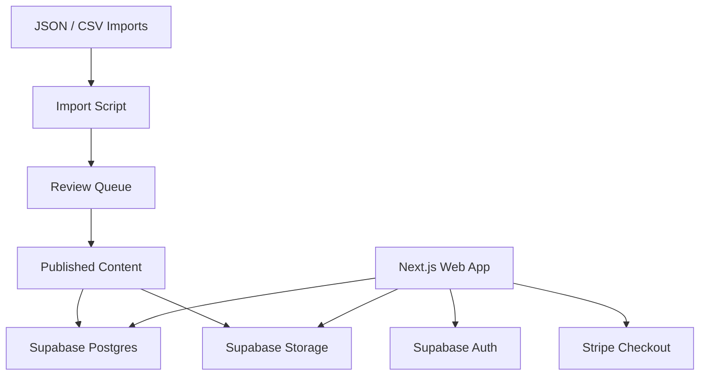

# Architecture: HSK Prep Web MVP

## 原则

1. 内容生产引擎与网站分离。
2. 网站只消费已发布内容。
3. 题目发布必须经过审核状态流。
4. 所有判分都在服务端完成。
5. 从 HSK1 起步，但模型可扩到 HSK1–9。

## 目录分工

- `apps/web/`: Next.js App Router 前后台应用
- `packages/shared/`: 领域类型、共享 sample data
- `packages/db/`: SQL row 类型、Supabase client、repository 封装
- `packages/ui/`: 可复用 UI 原子组件
- `services/parser/`: 未来的 PDF 解析服务接口规范
- `infra/sql/`: schema 与 seed
- `content/imports/`: 待导入结构化内容
- `content/published/`: 示例已发布内容 payload

## 数据流

## 当前实现

- 本地默认走 demo auth + mock repository，保证无外部服务时也能运行。
- 一旦 Supabase env 配齐，数据库 client、middleware 和导入脚本可切到真实后端。

## 下一步

1. 将 mock repository 替换为 Supabase repository。
2. 接真实 Supabase Auth 回调。
3. 将 Stripe Webhook 写入 subscriptions / audit_logs。
4. 让 parser 输出直接进入 review_tasks + content_items。
